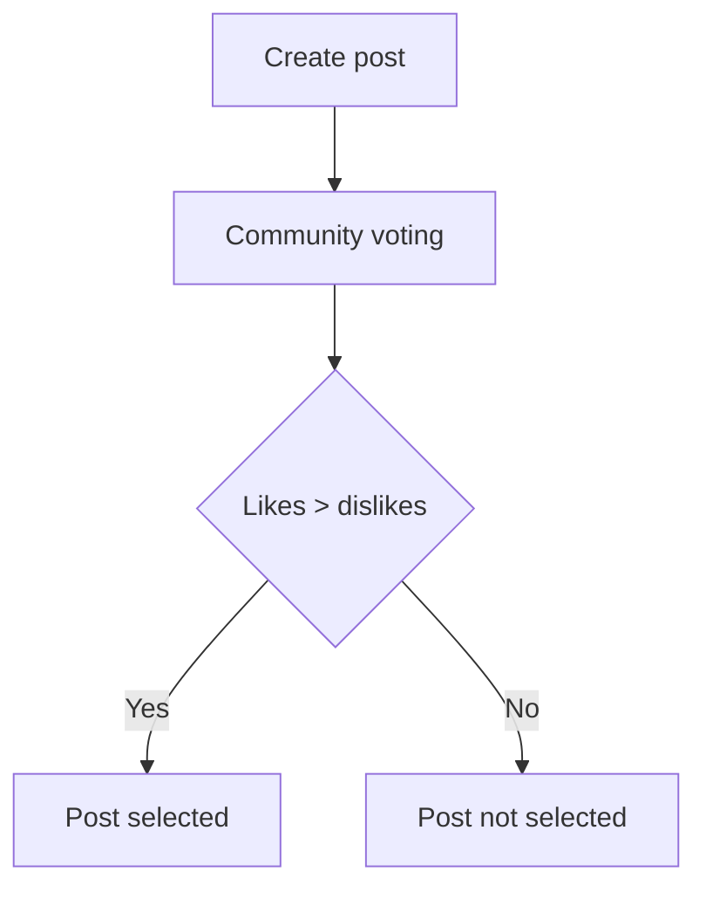

# Social media post selection process

The project is currently in the beta phase.

Many organisations wish to showcase their activities on social media platforms. 
However, particularly in larger companies, it is often not feasible to allow all 
employees to publish their own posts on the official channels.

A transparent and democratic selection process, in which all members of an organisation 
first submit their content to the community for approval before it is published, offers 
numerous advantages. It encourages participation and enables employees to gain insights 
into various perspectives within the organisation. At the same time, potentially 
problematic posts can be identified and prevented at an early stage.

SMPSP specifically supports this approach.

## Voting process

## Veto process
Only users with a veto level above 0 are permitted to issue a veto. 
A veto can only be overturned by someone whose veto level is higher than that of the 
person who placed the veto.

Veto level ranges from 0 to 2,147,483,647 :)

## Features
- [x] Simple user management
- [x] Passwordless authentication 
- [x] Create posts with text, images, videos and hashtags
- [x] Automatic conversion of images and videos that do not comply with web standards
- [x] Community voting on posts
- [x] Like and comment on posts
- [x] Veto and comment on posts
- [x] Download posts as a ZIP file
- [ ] Automatic posting on Instagram
- [ ] Automatic posting on Facebook
- [ ] Automatic posting on LinkedIn
- [ ] Automatic posting on X (formerly Twitter)
- [ ] Automatic posting on BlueSky
- [ ] Automatic posting on TikTok
- [ ] Automatic posting on YouTube
- [ ] Automatic posting on Mastodon